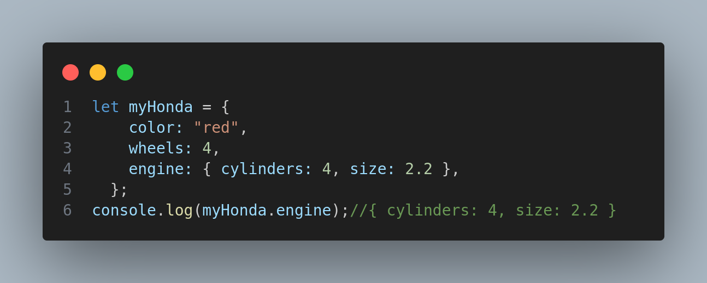

# What is Object in js
>[!TIP]
>An object is a collection of properties, and a property is an association between a name (or key) and a value. A property's value can be a function, in which case the property is known as a method. Objects in JavaScript, just as in many other programming languages, can be compared to objects in real life.
>`Объект — это набор свойств, а свойство — это связь между именем (или ключом)` и значением. Значение свойства может быть функцией, и в этом случае свойство называется методом. 

``` diff
-Объекты в JavaScript, как и во многих других языках программирования, можно сравнить с объектами в реальной жизни.
```


>Вверху мы объяснили, что `автомобиль` — это объект со `свойствами`. У автомобиля есть цвет, дизайн, вес, материал, из которого он сделан и т. д. Точно так же объекты JavaScript могут иметь свойства, определяющие их характеристики.


#### The syntax of Object in JavaScript
```js
let obj = {
  property1: value1, // property name 
  2: value2, // or a number
  "property n": value3, // or a string
};
```


#### Here is the example of making Object or how to use it and call walues by using fullstope


#### it is a kind of taking from this object that key that we need and hep it is Destructuring in array 
```js
let myHonda = {
    color: "red",
    wheels: 4,
    engine: { cylinders: 4, size: 2.2 },
  };
let {engine:{cylinders}}=myHonda
console.log(cylinders);  //4
```


>[!TIP]
>Object Methods
#### Object.assign()
` The Object.assign() static method copies all enumerable own properties from one or more source objects to a target object. It returns the modified target object.`Krch i 2 objecta yakjoya mekna


#### Object.entries()
>The Object.entries() static method returns an array of a given object's own enumerable string-keyed property key-value pairs.`krch it will return an array of Object in arraycha arraycha`
```js
let obj={
  a:"Anisa",
  b:"Person",
}
let a1=Object.entries(obj)
console.log(a1);//[ [ 'a', 'Anisa' ], [ 'b', 'Person' ] ]
```

#### Object.keys()
>The Object.keys() static method returns an array of a given object's own enumerable string-keyed property names.`i bowa klyuchoi xamu Objecta mebrora da 1 masiv []`


```js
let obj={
  a:"Anisa",
  b:"Person",
}
let a1=Object.keys(obj)
console.log(a1);//['a','b']
```

#### Object.values()
>The Object.values() static method returns an array of a given object's own enumerable string-keyed property values.`i valuowa da 1 array mebrora`
```js
let obj={
  a:"Anisa",
  b:"Person",
}
let a1=Object.values(obj)
console.log(a1);//[ 'Anisa', 'Person' ]
```


>[!TIP]
>Destructuring in Object
```js
let options = {
  title: "Menu",
  width: 100,
  height: 200
};

let {title, width, height} = options;

console.log(title);  // Menu
console.log(width);  // 100
console.log(height); // 200
```


>[!TIP]
>Spread Operator
>The spread operator is a feature in JavaScript that allows us to expand elements of an iterable (like an array or string) or object properties into places where multiple elements or properties are expected.`krch copy mekna bad bo i da ES6 paydo widai`
```js
let arr1 = [1, 2, 3];
let arr2 = [4, 5, 6];
let arr3 = [...arr1, ...arr2];
console.log(arr3); // Output: [1, 2, 3, 4, 5, 6]
```

#### This is an example for Object
```js
let obj1 = { x: 1, y: 2 };
let obj2 = { z: 3 };
let obj3 = { ...obj1, ...obj2 };
console.log(obj3); // Output: { x: 1, y: 2, z: 3 }
```

>[!TIP]
>This is a keyword va mo metonem 4 xolat dora 1xolatw dadruni object  2 giw da druni function 3 giw 
da druni object this knem Window niwon meta berun ai object knem Window use srictk knem strogiy rezhim mewava cos.log da  be strogi rezhim inderfined niwon meta